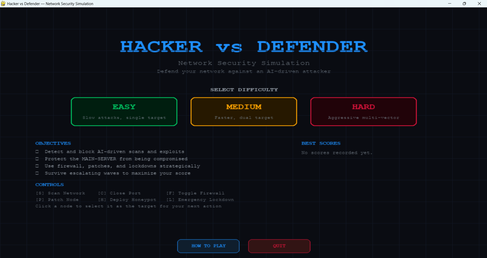
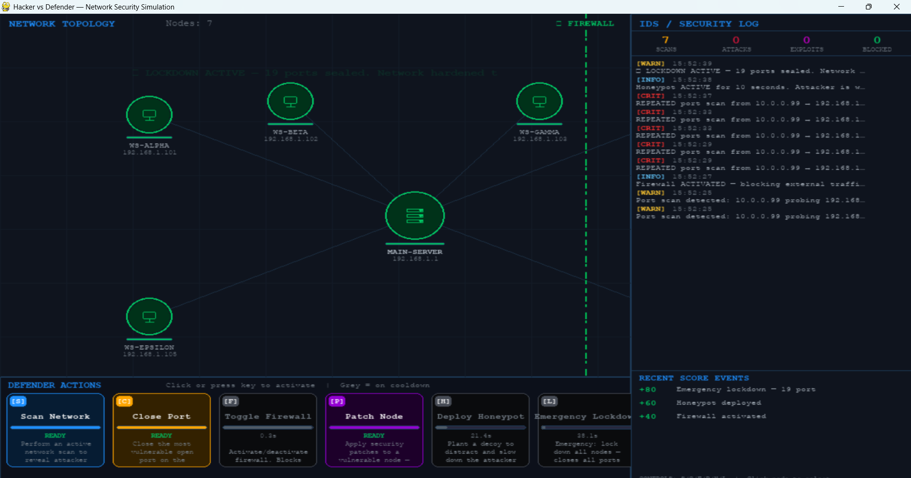

# 🛡️ Hacker vs Defender — Network Security Simulation

[](https://github.com/rahilmadoune/hacker-vs-defender/actions)
[](https://www.python.org/downloads/)
[](LICENSE)

> An interactive cybersecurity simulation game built in Python and Pygame, modelling real-world attack and defence strategies on a virtual network.

---

## 📸 Gameplay Screenshots


*Figure 1: Main Menu with difficulty selection, How to Play access, and persistent leaderboard.*


*Figure 2: Active simulation with packet flow, node status alerts, and firewall activated.*

---

## 📋 Table of Contents

- [Project Overview](#-project-overview)
- [Game Concept](#-game-concept)
- [Cybersecurity Learning Objectives](#-cybersecurity-learning-objectives)
- [Technologies Used](#️-technologies-used)
- [Project Structure](#-project-structure)
- [How to Run](#-how-to-run)
- [Gameplay Guide](#-gameplay-guide)
- [Game Mechanics](#️-game-mechanics)
- [Difficulty System](#-difficulty-system)
- [Testing & CI](#-testing--ci)
- [Future Improvements](#-future-improvements)

---

## 📌 Project Overview

**Hacker vs Defender** is an academic-grade cybersecurity simulation that places the player in the role of a network security analyst defending a corporate network against a persistent AI-driven attacker.

The simulation models a realistic attack lifecycle — from initial reconnaissance and port scanning, through active exploitation, to lateral movement and server compromise — and challenges the player to respond using authentic defensive techniques.

The project was developed as a **Python university coursework submission** to demonstrate practical understanding of:
- Network security principles
- Attack simulation and modelling
- Defensive countermeasures
- Intrusion detection systems

It's also built to hold up as a **standalone software engineering project**: the codebase is fully unit-tested and runs through continuous integration on every push, not just a coursework demo.

---

## 🎮 Game Concept

The network contains:
- **7 nodes** — workstations and a database server
- **1 central server** — the primary target (must be protected)
- **A configurable firewall** — can block attacker traffic
- **Simulated network ports** — SSH, HTTP, FTP, MySQL, Telnet, SMB and more

An **AI attacker** follows the **Cyber Kill Chain**:
1. 🔍 **Reconnaissance** — discovers live hosts via ping sweep
2. 🔎 **Scanning** — enumerates open ports (TCP SYN scan simulation)
3. 💥 **Exploitation** — probability-based exploit attempts on open ports
4. 🔗 **Persistence / Lateral Movement** — pivots through compromised nodes toward the server

The **player (Defender)** must:
- Detect suspicious activity using the IDS log
- Close vulnerable ports before they are exploited
- Activate the firewall to block the attacker's IP
- Patch damaged nodes to restore health
- Use strategic tools like the honeypot and emergency lockdown
- Survive a target number of attack waves to win

---

## 🎓 Cybersecurity Learning Objectives

| Concept | Implementation |
|--------|---------------|
| **Cyber Kill Chain** | AI attacker phases (Recon → Scan → Exploit → Persist) |
| **Port Security** | Open/closed/filtered port states, service enumeration |
| **Firewall Management** | Toggle-able firewall with IP block rules |
| **Intrusion Detection** | IDS with severity-based alerting and scan counters |
| **Vulnerability Patching** | Health restoration, port hardening actions |
| **Deception Technology** | Honeypot deployment to misdirect attacker |
| **Attack Probability Modelling** | Exploit success probability with escalation over time |
| **Incident Response** | Player must prioritise actions under time pressure |
| **Network Topology** | Visual representation of nodes, connections, and trust zones |

---

## 🛠️ Technologies Used

| Technology | Purpose |
|-----------|---------|
| **Python 3.9+** | Core language |
| **Pygame 2.x** | 2D rendering, event handling, animation |
| **dataclasses** | Clean, typed data models for network entities |
| **enum** | Type-safe state machines |
| **random** | Monte Carlo exploit probability simulation |
| **time** | Cooldown management, IDS timestamps |
| **pytest** | Unit test suite |
| **GitHub Actions** | Continuous integration across Python 3.9–3.12 |

---

## 📁 Project Structure

```
hacker-vs-defender/
│
├── main.py                     # Entry point, game loop & state machine
├── network.py                  # Network topology, nodes, ports, firewall, IDS
├── attacker_ai.py               # AI hacker — kill chain phases, packet animation
├── defender_actions.py         # Player actions, scoring system, cooldowns
├── ui.py                       # Pygame rendering — diagram, HUD, log panel, tutorial
├── high_scores.py              # Persistent leaderboard & tutorial-seen flag (scores.json)
├── assets/                     # Screenshots and future image/sound assets
├── tests/                      # pytest unit test suite
│   ├── test_network.py
│   ├── test_attacker.py
│   ├── test_defender.py
│   └── test_high_scores.py
├── pytest.ini                  # pytest configuration
├── requirements.txt            # Runtime dependencies
├── requirements-dev.txt        # Development/test dependencies
├── .gitignore
├── LICENSE                     # MIT License
└── README.md                   # This file
```

### Module Responsibilities

**`network.py`**
Defines the core simulation entities: `NetworkNode`, `Port`, `Firewall`, and `IDS`. Provides the `build_network()` factory to construct the initial topology.

**`attacker_ai.py`**
Implements the `AttackerAI` class as a finite-state machine cycling through kill chain phases. Includes the `Packet` class for animated traffic visualisation, three configurable difficulty profiles, and a `speed_multiplier` hook used by the honeypot slowdown effect.

**`defender_actions.py`**
Provides the `DefenderController` with six defender actions, each with its own cooldown. The `ScoreTracker` awards/deducts points for player actions and network events, and evaluates the win/loss conditions.

**`ui.py`**
The entire Pygame rendering engine. Draws the network diagram, HUD, action bar with cooldown bars, IDS alert log, the main menu (with leaderboard), game-over screen, and the multi-page How to Play tutorial.

**`high_scores.py`**
Lightweight JSON persistence layer (`scores.json`) storing the top 5 high scores and whether the player has completed the first-run tutorial.

**`main.py`**
The top-level `HackerVsDefender` class orchestrates all systems through a `MENU → HOW_TO_PLAY → PLAYING → GAME_OVER` state machine.

---

## 🚀 How to Run

### Prerequisites

- Python 3.9 or higher
- pip

### Installation

```bash
# 1. Clone the repository
git clone https://github.com/your-username/hacker-vs-defender.git
cd hacker-vs-defender

# 2. (Optional) Create a virtual environment
python -m venv venv
source venv/bin/activate        # Linux / macOS
venv\Scripts\activate.bat       # Windows

# 3. Install dependencies
pip install -r requirements.txt

# (Optional) Install development dependencies for testing
pip install -r requirements-dev.txt

# 4. Run the game
python main.py

# 5. Run the test suite
python -m pytest
```

### Controls

| Key | Action |
|-----|--------|
| `S` | Scan Network |
| `C` | Close Port (on selected node) |
| `F` | Toggle Firewall |
| `P` | Patch Node |
| `H` | Deploy Honeypot |
| `L` | Emergency Lockdown |
| `ESC` | Return to menu (or skip tutorial) |
| `←` / `→` | Navigate How to Play pages |
| `Enter` | Next / Done on How to Play |
| **Mouse click (node)** | Select node as target |
| **Mouse click (button)** | Execute action |

---

## 🎮 Gameplay Guide

> **New here?** A multi-page **How to Play** tutorial launches automatically on your first run, covering the objective, node color states, and every defender action. You can reopen it anytime from the **HOW TO PLAY** button on the main menu.

1. **Select your difficulty** from the main menu (Easy / Medium / Hard).
2. The **network diagram** shows all nodes in their current security state.
3. Watch the **IDS log** (right panel) for alerts — CRITICAL alerts need immediate attention.
4. **Port badges** (numbered circles on nodes) show how many open ports an attacker can exploit.
5. **Close ports** and **patch nodes** to reduce the attack surface.
6. **Activate the firewall** early — it blocks the attacker's IP and significantly slows progress.
7. Survive **attack waves** for bonus score points.
8. The game ends in a **Victory** when you survive the target number of waves (Easy = 3, Medium = 5, Hard = 7) without the server being compromised, or a **Loss** if the server's health drops to 0%.
9. Scores are automatically saved to a local leaderboard (top 5), shown on the main menu and game-over screen.

### Node Colour Guide

| Colour | Meaning |
|--------|---------|
| 🟢 Green | Secure |
| 🟡 Yellow | Being scanned by attacker |
| 🟠 Orange | Vulnerable (open ports discovered) |
| 🔴 Red-Orange | Under active attack |
| ❤️ Crimson | Compromised |
| 🔵 Cyan | Patched |

---

## ⚙️ Game Mechanics

### Attacker AI — Kill Chain

The AI cycles through four phases:

| Phase | Behaviour |
|-------|-----------|
| Reconnaissance | Discovers nodes (ping sweep simulation) |
| Port Scanning | Enumerates open ports on known nodes |
| Exploitation | Probabilistic exploit attempts on open ports |
| Persistence | Lateral movement toward the server via compromised nodes |

**Escalation**: The attacker's exploit success probability increases over time, simulating a more experienced or determined adversary.

### Scoring

| Event | Points |
|-------|--------|
| Port closed | +50 |
| Node patched | +75 |
| Attack blocked | +30 |
| Firewall activated | +40 |
| Network scan | +20 |
| Honeypot deployed | +60 |
| Emergency lockdown | +80 |
| Wave survived | +100 |
| Game won | +300 |
| Node compromised | −150 |
| Server damaged | −50 |
| Server compromised | −500 |

### Defender Cooldowns

| Action | Cooldown |
|--------|----------|
| Scan Network | 8s |
| Close Port | 5s |
| Toggle Firewall | 15s |
| Patch Node | 12s |
| Deploy Honeypot | 25s |
| Emergency Lockdown | 40s |

---

## 🎚️ Difficulty System

| Setting | Scan Interval | Attack Interval | Exploit Chance | Max Targets | Wave Interval | Waves to Win |
|---------|--------------|-----------------|---------------|-------------|---------------|---------------|
| **Easy** | 4.0s | 6.0s | 25% | 1 | 45s | 3 |
| **Medium** | 2.5s | 3.5s | 40% | 2 | 30s | 5 |
| **Hard** | 1.0s | 1.8s | 60% | 3 | 20s | 7 |

---

## 🧪 Testing & CI

The core simulation logic — network state, attacker AI, defender actions, scoring, and high-score persistence — is covered by a `pytest` suite in `tests/`. UI rendering (`ui.py`) is intentionally excluded from unit tests, since it's Pygame drawing code best verified by playing the game.

```bash
pip install -r requirements-dev.txt
python -m pytest
```

Every push and pull request automatically runs the full suite across **Python 3.9, 3.10, 3.11, and 3.12** via GitHub Actions (`.github/workflows/ci.yml`), so compatibility claims in this README are continuously verified rather than just asserted.

---

## 🔮 Future Improvements

- [x] **Saved high scores** — persistent leaderboard via JSON
- [x] **In-game onboarding** — first-run How to Play tutorial
- [ ] **Multiple attack vectors** — DDoS simulation, SQL injection, phishing
- [ ] **Network traffic visualisation** — packet graph / flow diagram
- [ ] **Node roles** — add router, VPN gateway, DMZ segment
- [ ] **Attacker profiles** — script-kiddie, nation-state, insider threat
- [ ] **Event replay** — review the full attack timeline post-game
- [ ] **Sound effects** — alert sounds, firewall activation audio
- [ ] **Web-playable build** — pygbag/WASM export for in-browser play
- [ ] **Multiplayer mode** — two players, one attacker and one defender

---

## 📚 Academic References

This simulation draws on the following cybersecurity frameworks:

- **Lockheed Martin Cyber Kill Chain** — 7-stage intrusion model
- **MITRE ATT&CK Framework** — adversary tactics, techniques, and procedures
- **NIST SP 800-61** — Computer Security Incident Handling Guide
- **CIS Controls** — prioritised defensive security actions

---

## 👤 Author

**Rahil Aya Soulaf MADOUNE**

## 📄 License

Released under the [MIT License](LICENSE) — free to use, modify, and distribute with attribution.

---

*Developed as a TEST GAME on a cybersecurity project. All attack simulations are fictional and for educational purposes only.*
